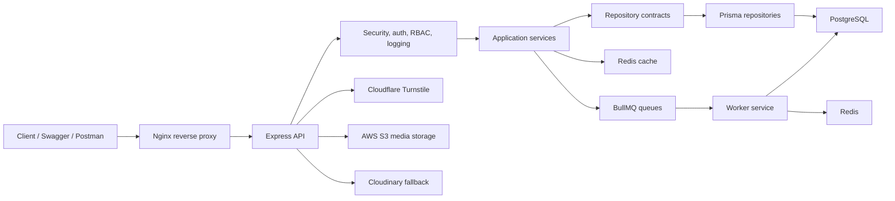

# Streamly

[](https://github.com/tushar-gour/streamly-server/actions/workflows/ci.yml)


Production-grade TypeScript video platform backend, built to demonstrate senior backend
architecture, secure authentication, authorization, background jobs,
observability, testing, containerized runtime, and API documentation.

Streamly is a YouTube-inspired backend API. It is not a clone of YouTube. The
repository is a complete backend engineering portfolio project with a
production-style local runtime, owner-confirmed HTTPS domain, and
deployment-ready documentation.

**Business route count:** `52`  
**Production domain:** `https://streamly.zytheran.me`  
**Runtime shape:** `Nginx -> Express API -> PostgreSQL / Redis / BullMQ worker`

---

## Quick Links

| Resource | Link |
| --- | --- |
| API guide | [docs/API.md](docs/API.md) |
| Architecture | [docs/ARCHITECTURE.md](docs/ARCHITECTURE.md) |
| System design | [docs/SYSTEM_DESIGN.md](docs/SYSTEM_DESIGN.md) |
| Security | [docs/SECURITY.md](docs/SECURITY.md) |
| Runbook | [docs/RUNBOOK.md](docs/RUNBOOK.md) |
| Deployment preparation | [docs/DEPLOYMENT.md](docs/DEPLOYMENT.md) |
| Environment variables | [docs/ENVIRONMENT.md](docs/ENVIRONMENT.md) |
| Testing | [docs/TESTING.md](docs/TESTING.md) |
| OpenAPI source | [src/docs/openapi/openapi-document.ts](src/docs/openapi/openapi-document.ts) |
| Postman collection | [docs/postman/streamly.postman_collection.json](docs/postman/streamly.postman_collection.json) |

---

## Why This Project Stands Out

Streamly is designed as a flagship backend portfolio project, not a tutorial
API. It shows production backend judgment across architecture, security,
runtime operations, and developer experience.

| Strength | What it demonstrates |
| --- | --- |
| Clean Architecture | Controllers stay thin, services own workflows, repositories isolate persistence |
| PostgreSQL + Prisma | Relational schema, migrations, constraints, repository-backed data access |
| Production Auth | JWT access tokens, refresh rotation, OTP login, TOTP MFA, short-lived MFA trust |
| Authorization | RBAC roles, permissions, user-role mappings, ownership policies |
| Redis + BullMQ | Cache foundation, queue infrastructure, separate worker runtime |
| Provider Integrations | AWS S3, SendGrid, Twilio SMS, Twilio WhatsApp, Cloudflare Turnstile |
| Security Hardening | Helmet, CORS, rate limits, sanitization, secure cookies, trusted proxy |
| Observability | Pino JSON logs, request IDs, correlation IDs, redaction, audit log foundation |
| Docker Runtime | App, worker, PostgreSQL, Redis, and Nginx in Docker Compose |
| Testing Foundation | Vitest, Supertest, API contract tests, coverage, guarded DB integration tests |
| API Documentation | OpenAPI 3.1, Swagger UI, Postman collection |
| CI/CD Foundation | GitHub Actions checks quality, tests, OpenAPI, Prisma, and Docker build |

---

## System Architecture



Core dependency direction:

```txt
Presentation -> Application Services -> Domain Contracts -> Infrastructure
```

Detailed architecture: [docs/ARCHITECTURE.md](docs/ARCHITECTURE.md).

---

## Feature Matrix

| Area | Implemented | Why it matters |
| --- | --- | --- |
| Architecture | Clean architecture, DI container, repositories | Keeps system maintainable and testable |
| Authentication | JWT, refresh rotation, sessions | Supports production-grade login lifecycle |
| Authorization | RBAC, permissions, ownership policies | Prevents privilege escalation and cross-user access |
| Database | PostgreSQL, Prisma, migrations | Provides relational integrity and repeatable schema changes |
| Cache | Redis cache abstraction | Speeds selected public reads without changing API behavior |
| Jobs | BullMQ queues and worker | Moves background-ready work outside request lifecycle |
| Security | Helmet, CORS, rate limits, sanitization | Hardens Express runtime |
| Observability | Pino logs, request IDs, redaction | Makes runtime diagnosable without leaking secrets |
| Testing | Unit, service, API, guarded integration tests | Protects behavior during future changes |
| API Docs | Swagger UI, OpenAPI JSON, Postman | Makes API review and testing easy |
| Video Streaming | HTTP Range endpoint with 206/416 handling | Supports large video chunk playback |
| Docker | App, worker, Postgres, Redis, Nginx | Reproducible local production-style runtime |
| CI/CD | GitHub Actions quality pipeline | Verifies every push and pull request |
| Nginx | Reverse proxy and domain preparation | Prepares hosted URL routing |

---

## Tech Stack

| Category | Technologies |
| --- | --- |
| Backend | Node.js, TypeScript, Express.js, ES Modules |
| Database | PostgreSQL, Prisma |
| Cache | Redis |
| Jobs | BullMQ |
| Authentication | JWT, bcrypt, persistent sessions |
| Authorization | RBAC, permissions, ownership policies |
| Security | Helmet, CORS, express-rate-limit, sanitization, secure cookies |
| Media | Multer, Cloudinary |
| Logging | Pino, request IDs, correlation IDs |
| Testing | Vitest, Supertest, coverage |
| Documentation | OpenAPI 3.1, Swagger UI, Postman |
| DevOps | Docker, Docker Compose, Nginx, GitHub Actions |

---

## Local Development Quickstart

Prerequisites:

- Node.js 20 recommended
- PostgreSQL
- Redis
- Cloudinary account for real upload workflows

```bash
git clone https://github.com/tushar-gour/streamly-server.git
cd streamly-server
npm install
cp .env.example .env
npm run prisma:generate
npm run prisma:migrate
npm run seed:rbac
npm start
```

Development mode:

```bash
npm run dev
```

Healthcheck:

```bash
curl http://localhost:8000/api/v1/healthcheck
```

Environment guide: [docs/ENVIRONMENT.md](docs/ENVIRONMENT.md).

---

## Docker Runtime

Streamly includes a full local Docker Compose runtime:

| Service | Purpose |
| --- | --- |
| `app` | Express API and Prisma migration startup |
| `worker` | BullMQ background job worker |
| `postgres` | PostgreSQL 16 database |
| `redis` | Redis cache and queue backend |
| `nginx` | Reverse proxy for production-style routing |

Start Docker runtime:

```bash
cp .env.docker.example .env.docker
docker compose up --build
```

Useful URLs:

| Target | URL |
| --- | --- |
| Direct API | `http://localhost:8000` |
| Nginx proxy | `http://localhost:8080` |
| Health through Nginx | `http://localhost:8080/api/v1/healthcheck` |
| Swagger through Nginx | `http://localhost:8080/api/v1/docs` |
| OpenAPI through Nginx | `http://localhost:8080/api/v1/docs/openapi.json` |

Verify Docker runtime:

```bash
npm run verify:docker
npm run verify:jobs
```

Operational guide: [docs/RUNBOOK.md](docs/RUNBOOK.md).

---

## API Documentation

Swagger UI:

```txt
http://localhost:8000/api/v1/docs
http://localhost:8080/api/v1/docs
```

OpenAPI JSON:

```txt
http://localhost:8000/api/v1/docs/openapi.json
http://localhost:8080/api/v1/docs/openapi.json
```

Postman:

```txt
docs/postman/streamly.postman_collection.json
```

The API uses bearer access tokens and also supports auth cookies where
configured. Exact route contracts, request bodies, multipart upload fields,
pagination behavior, and error shapes are documented in OpenAPI.

Business route count: `52`.

Streaming route:

```txt
GET /api/v1/videos/{videoId}/stream
```

Send `Range: bytes=0-1048575` for chunked playback. Valid ranges return `206 Partial Content`; invalid ranges return `416 Range Not Satisfiable`.

API guide: [docs/API.md](docs/API.md).

---

## Security Highlights

- Short-lived JWT access tokens.
- Refresh token rotation.
- Refresh tokens hashed at rest.
- Persistent PostgreSQL sessions.
- Current-session logout.
- Logout-all session revocation.
- Email verification token infrastructure.
- RBAC roles and permissions.
- Centralized ownership policies.
- Helmet security headers.
- Environment-aware CORS.
- Global and auth route rate limiting.
- Request sanitization against null bytes and prototype pollution keys.
- Secure cookie configuration.
- Trusted proxy configuration.
- Redacted structured logs.

This repository does not claim a formal security audit.

Security details: [docs/SECURITY.md](docs/SECURITY.md).

---

## Background Jobs

BullMQ queues are backed by Redis and processed by a separate worker service.

| Queue | Purpose |
| --- | --- |
| `streamly-email` | Email verification delivery through SendGrid when configured |
| `streamly-notification` | Notification foundation with Twilio SMS provider support |
| `streamly-thumbnail` | Cloudinary transformations or S3 ffmpeg frame extraction |
| `streamly-cleanup` | Expired auth artifact cleanup |
| `streamly-verification` | Safe queue verification |

Provider calls use safe no-op behavior unless explicitly enabled and configured
with production credentials.

---

## Testing And CI

Local verification:

```bash
npm run format:check
npm run lint
npm run syntax
npm run smoke
npm run verify
npm test
npm run test:unit
npm run test:integration
npm run test:api
npm run test:coverage
npm run docs:validate
npx prisma validate
npx prisma generate
docker compose config
```

GitHub Actions runs on:

- push to `main`
- pull requests

CI jobs:

| Job | Checks |
| --- | --- |
| Quality | format, lint, syntax, smoke, verify, audit report |
| Tests | Vitest suite, unit, API, integration command, coverage |
| OpenAPI | docs validation |
| Prisma | generate and validate |
| Docker Build | image build and Compose config validation |

Database-backed integration tests are guarded and skipped unless explicitly
enabled with a safe test database.

Testing guide: [docs/TESTING.md](docs/TESTING.md).

---

## Documentation Map

| Document | Purpose |
| --- | --- |
| [docs/README.md](docs/README.md) | Documentation index |
| [docs/ARCHITECTURE.md](docs/ARCHITECTURE.md) | Clean architecture and runtime flows |
| [docs/SYSTEM_DESIGN.md](docs/SYSTEM_DESIGN.md) | Requirements, entities, tradeoffs |
| [docs/SECURITY.md](docs/SECURITY.md) | Auth, RBAC, hardening, limitations |
| [docs/RUNBOOK.md](docs/RUNBOOK.md) | Operations and troubleshooting |
| [docs/DEPLOYMENT.md](docs/DEPLOYMENT.md) | Deployment preparation checklist |
| [docs/ENVIRONMENT.md](docs/ENVIRONMENT.md) | Environment variable reference |
| [docs/TESTING.md](docs/TESTING.md) | Test strategy and commands |
| [docs/API.md](docs/API.md) | Swagger, Postman, auth, response format |
| [docs/IMPLEMENTATION_PLAN.md](docs/IMPLEMENTATION_PLAN.md) | Completed roadmap status |
| [CHANGELOG.md](CHANGELOG.md) | Release notes |
| [CONTRIBUTING.md](CONTRIBUTING.md) | Contribution workflow |

---

## Deployment Readiness

Streamly has an owner-confirmed HTTPS domain. This repository does not automate
cloud provisioning, DNS, or certificate renewal.

Production domain:

```txt
https://streamly.zytheran.me
```

Production HTTPS routes:

```txt
https://streamly.zytheran.me/api/v1/healthcheck
https://streamly.zytheran.me/api/v1/docs
https://streamly.zytheran.me/api/v1/docs/openapi.json
```

DNS record needed:

```txt
Host: streamly
Type: A
Value: SERVER_PUBLIC_IP
TTL: Auto/default
```

AWS deployment remains manual and is documented for the owner to complete.

Deployment guide: [docs/DEPLOYMENT.md](docs/DEPLOYMENT.md).

---

## Repository Structure

```txt
src/
  application/services/      business workflows
  config/                    centralized environment config
  core/container/            dependency composition
  domain/repositories/       repository contracts
  infrastructure/            Prisma, Redis, BullMQ, Cloudinary, logging
  presentation/              routes, controllers, middleware
  shared/                    responses, errors, validators, helpers
  workers/                   worker entrypoint
prisma/                      schema and migrations
tests/                       unit, service, API, integration tests
docs/                        architecture and operations docs
scripts/                     verification and seed scripts
nginx/                       reverse proxy config
.github/workflows/           CI pipeline
```

---

## Commands Reference

| Command | Purpose |
| --- | --- |
| `npm run format` | Apply Prettier to supported files |
| `npm run format:check` | Check formatting |
| `npm run lint` | Run ESLint |
| `npm run typecheck` | Run TypeScript typecheck |
| `npm run build` | Build TypeScript into `dist` |
| `npm run syntax` | Check JavaScript helper script syntax |
| `npm run smoke` | Import app and verify route registration |
| `npm run verify` | Run local quality gate |
| `npm test` | Run Vitest suite |
| `npm run test:unit` | Run unit and service tests |
| `npm run test:integration` | Run guarded integration tests |
| `npm run test:api` | Run API contract tests |
| `npm run test:coverage` | Generate coverage report |
| `npm run docs:validate` | Validate OpenAPI document |
| `npm run verify:docker` | Verify Docker runtime |
| `npm run verify:jobs` | Verify BullMQ jobs |
| `npm run seed:rbac` | Seed roles and permissions |
| `npm run jobs:worker` | Start worker locally |
| `npm run prisma:generate` | Generate Prisma client |
| `npm run prisma:migrate` | Run local Prisma migration |
| `npm run docker:up` | Start Docker runtime |
| `npm run docker:down` | Stop Docker runtime |

---

## Known Limitations

- AWS deployment is manual and not automated in this repository.
- Real credentials must be configured by the owner in production env files.
- Twilio SendGrid and Twilio SMS providers require production credentials.
- S3 storage is available through `MEDIA_STORAGE_PROVIDER=s3`; production credentials must be configured by owner.
- Redis-backed distributed rate limiting is not implemented.
- External monitoring and tracing are not integrated.
- Database-backed integration tests are guarded by default.
- Dependency advisories remain and are reported by CI.
- No formal security audit has been completed.
- The repository is proprietary and not open source.

---

## Future Improvements

- AWS/VPS deployment workflow.
- Certificate renewal automation.
- Dependency advisory remediation.
- OpenTelemetry metrics and traces.
- External monitoring and alerting.
- Broader database-backed integration coverage.
- Higher coverage targets.
- Backup and rollback automation.

---

## Project Status

All planned roadmap phases are complete. The repository is ready for portfolio
review, backend architecture review, DevOps review, and future deployment work.

## License

This repository is proprietary. All rights are reserved by Tushar Gour. The
code is available for portfolio review only. No reuse, copying, redistribution,
hosting, deployment, sublicensing, sale, or derivative work is permitted without
prior written permission.
