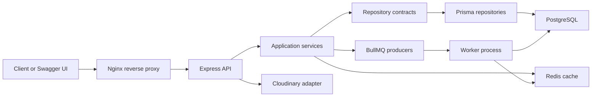

# Streamly Backend

[](https://github.com/tushar-gour/streamly-server/actions/workflows/ci.yml)

Streamly is a production-grade video platform backend built as a senior backend
engineering portfolio project. It started as a YouTube-style API and now
demonstrates clean architecture, PostgreSQL persistence, JWT sessions, RBAC,
Redis, BullMQ workers, structured logging, OpenAPI documentation, Docker,
Nginx, automated tests, and GitHub Actions CI.

The project is not claimed as a live production deployment. The repository is
deployment-ready at the Docker Compose level, with `streamly.zytheran.me`
prepared as the planned HTTP host. HTTPS, DNS automation, cloud provisioning,
and deployment automation are intentionally deferred.

## Contents

- [Tech Stack](#tech-stack)
- [Architecture](#architecture)
- [Production Features](#production-features)
- [System Diagram](#system-diagram)
- [Quick Start](#quick-start)
- [Docker Runtime](#docker-runtime)
- [API Documentation](#api-documentation)
- [Testing And CI](#testing-and-ci)
- [Repository Structure](#repository-structure)
- [Useful Commands](#useful-commands)
- [Domain Preparation](#domain-preparation)
- [Known Limitations](#known-limitations)
- [Documentation](#documentation)

## Tech Stack

| Area | Technology |
| --- | --- |
| Runtime | Node.js, Express.js, JavaScript ES Modules |
| Database | PostgreSQL, Prisma |
| Cache and queues | Redis, BullMQ |
| Auth | JWT access tokens, refresh token rotation, persistent sessions |
| Authorization | RBAC, permissions, ownership policies |
| Security | Helmet, CORS hardening, rate limiting, sanitization, secure cookies |
| Uploads | Multer, Cloudinary |
| Observability | Pino structured logs, request IDs, correlation IDs, audit logs |
| Docs | OpenAPI 3.1, Swagger UI, Postman collection |
| Testing | Vitest, Supertest, coverage |
| Runtime | Docker, Docker Compose, Nginx reverse proxy |
| CI | GitHub Actions |

## Architecture

Streamly follows clean architecture boundaries:

```txt
Presentation -> Application Services -> Domain Contracts -> Infrastructure
```

Controllers stay thin. Services orchestrate use cases. Repositories hide Prisma.
Infrastructure owns PostgreSQL, Redis, BullMQ, Cloudinary, logging, and Docker
runtime integration.



More detail: [docs/ARCHITECTURE.md](docs/ARCHITECTURE.md).

## Production Features

| Category | Status |
| --- | --- |
| Clean architecture | Complete |
| PostgreSQL and Prisma migration | Complete |
| Docker Compose runtime | Complete |
| Nginx reverse proxy | Complete |
| JWT authentication | Complete |
| Refresh token rotation | Complete |
| Persistent sessions | Complete |
| Email verification token infrastructure | Complete |
| Real email delivery | Deferred |
| RBAC and ownership policies | Complete |
| Redis infrastructure | Complete |
| Redis caching | Complete for selected public reads |
| BullMQ workers | Complete |
| Thumbnail processing | Queue placeholder only |
| Security middleware | Complete |
| Structured logging | Complete |
| OpenAPI docs | Complete |
| Tests and coverage | Complete |
| GitHub Actions CI | Complete |
| Live cloud deployment | Deferred |
| HTTPS automation | Deferred |

## Core API Modules

- Healthcheck
- Users and authentication
- Videos
- Comments
- Likes
- Playlists
- Subscriptions
- Dashboard
- Swagger/OpenAPI docs

Business route count: `42`.

Docs routes are separate:

```txt
GET /api/v1/docs
GET /api/v1/docs/openapi.json
```

## Security Summary

- Passwords are hashed.
- Refresh tokens are hashed at rest.
- Refresh tokens rotate on refresh.
- Sessions are persisted in PostgreSQL.
- Logout revokes current session.
- Logout-all revokes all sessions.
- RBAC permissions protect sensitive actions.
- Ownership policies protect user-owned resources.
- Helmet adds API-safe security headers.
- CORS is centralized and environment-aware.
- Rate limiting protects global and auth routes.
- Request sanitization removes null bytes and prototype pollution keys.
- Logs redact secrets, tokens, cookies, passwords, and connection strings.

Security details: [docs/SECURITY.md](docs/SECURITY.md).

## Performance Summary

- Redis-backed cache abstraction.
- Public video list caching.
- Anonymous video comment caching.
- Namespace-scoped cache invalidation.
- Compression enabled.
- Prisma relation counts reduce payload and query overhead.
- Cursor pagination is not claimed; existing page/limit behavior is preserved.

## Background Jobs

BullMQ queues:

```txt
streamly-email
streamly-notification
streamly-thumbnail
streamly-cleanup
streamly-verification
```

Worker runtime is separate from the Express API. Email delivery and
notifications currently use infrastructure stubs. No external email provider is
configured.

## Quick Start

Prerequisites:

```txt
Node.js 20 recommended
PostgreSQL
Redis
Cloudinary account for real uploads
```

Install dependencies:

```bash
npm install
```

Create local environment:

```bash
cp .env.example .env
```

Fill PostgreSQL, Redis, JWT, RBAC, and Cloudinary values.

Generate Prisma client:

```bash
npm run prisma:generate
```

Apply migrations:

```bash
npm run prisma:migrate
```

Seed RBAC roles and permissions:

```bash
npm run seed:rbac
```

Start API:

```bash
npm start
```

Development mode:

```bash
npm run dev
```

## Docker Runtime

Create Docker environment:

```bash
cp .env.docker.example .env.docker
```

Fill JWT and Cloudinary placeholders. Keep Docker service hostnames:

```txt
DATABASE_URL -> postgres
REDIS_URL    -> redis
```

Start runtime:

```bash
docker compose up --build
```

Services:

```txt
app
worker
postgres
redis
nginx
```

Local URLs:

```txt
Direct API:      http://localhost:8000
Nginx proxy:     http://localhost:8080
Health direct:   http://localhost:8000/api/v1/healthcheck
Health proxy:    http://localhost:8080/api/v1/healthcheck
Swagger direct:  http://localhost:8000/api/v1/docs
Swagger proxy:   http://localhost:8080/api/v1/docs
OpenAPI proxy:   http://localhost:8080/api/v1/docs/openapi.json
```

Verify Docker runtime:

```bash
npm run verify:docker
npm run verify:jobs
```

Runbook: [docs/RUNBOOK.md](docs/RUNBOOK.md).

## API Documentation

Swagger UI:

```txt
http://localhost:8000/api/v1/docs
http://localhost:8080/api/v1/docs
```

OpenAPI JSON:

```txt
http://localhost:8000/api/v1/docs/openapi.json
http://localhost:8080/api/v1/docs/openapi.json
```

Postman collection:

```txt
docs/postman/streamly.postman_collection.json
```

API guide: [docs/API.md](docs/API.md).

## Testing And CI

Local checks:

```bash
npm run format:check
npm run lint
npm run syntax
npm run smoke
npm run verify
npm test
npm run test:unit
npm run test:integration
npm run test:api
npm run test:coverage
npm run docs:validate
npx prisma generate
npx prisma validate
docker build -t streamly-server:ci .
docker compose config
```

GitHub Actions runs on `push` to `main` and `pull_request`.

CI jobs:

```txt
quality
tests
docs
prisma
docker-build
```

Dependency audit is informational and non-blocking because known dependency
advisories currently exist.

Testing guide: [docs/TESTING.md](docs/TESTING.md).

## Repository Structure

```txt
src/
  app.js
  index.js
  application/services/
  config/
  core/container/
  domain/repositories/
  infrastructure/
    cache/
    cloudinary/
    database/
    jobs/
    logger/
    redis/
    repositories/
  presentation/
    controllers/
    middlewares/
    routes/
  shared/
  workers/
prisma/
docs/
tests/
scripts/
nginx/
.github/workflows/
```

## Useful Commands

```bash
npm run format
npm run format:check
npm run lint
npm run syntax
npm run smoke
npm run verify
npm run verify:live
npm run verify:docker
npm run verify:jobs
npm test
npm run test:coverage
npm run docs:validate
npm run seed:rbac
npm run jobs:worker
npm run prisma:generate
npm run prisma:migrate
npm run docker:up
npm run docker:down
```

## Domain Preparation

Planned host:

```txt
http://streamly.zytheran.me
```

DNS record needed before the domain works:

```txt
Host: streamly
Type: A
Value: SERVER_PUBLIC_IP
TTL: Auto/default
```

Nginx already accepts:

```txt
localhost
streamly.zytheran.me
```

HTTPS, Certbot, DNS provider automation, and cloud provisioning are not included
in this repository yet.

Deployment preparation: [docs/DEPLOYMENT.md](docs/DEPLOYMENT.md).

## Known Limitations

- No live deployment is claimed.
- HTTPS is not configured.
- Real email delivery is not configured.
- Thumbnail processing is a queue placeholder.
- Redis-backed distributed rate limiting is not implemented.
- External monitoring, tracing, and alerting are not integrated.
- Database-backed integration tests are guarded and skipped by default.
- Dependency audit currently reports advisories.
- No standalone `LICENSE` file is included yet; package metadata currently uses
  `ISC`.

## Documentation

- [Architecture](docs/ARCHITECTURE.md)
- [System Design](docs/SYSTEM_DESIGN.md)
- [Security](docs/SECURITY.md)
- [Runbook](docs/RUNBOOK.md)
- [Deployment Preparation](docs/DEPLOYMENT.md)
- [Environment Variables](docs/ENVIRONMENT.md)
- [Testing](docs/TESTING.md)
- [API Guide](docs/API.md)
- [Implementation Plan](docs/IMPLEMENTATION_PLAN.md)
- [Contributing](CONTRIBUTING.md)
- [Changelog](CHANGELOG.md)
