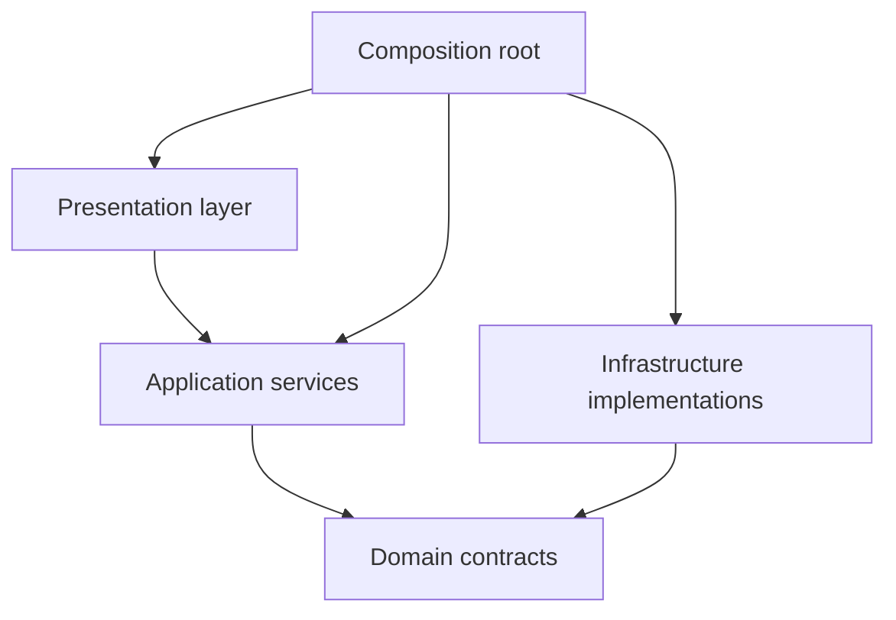
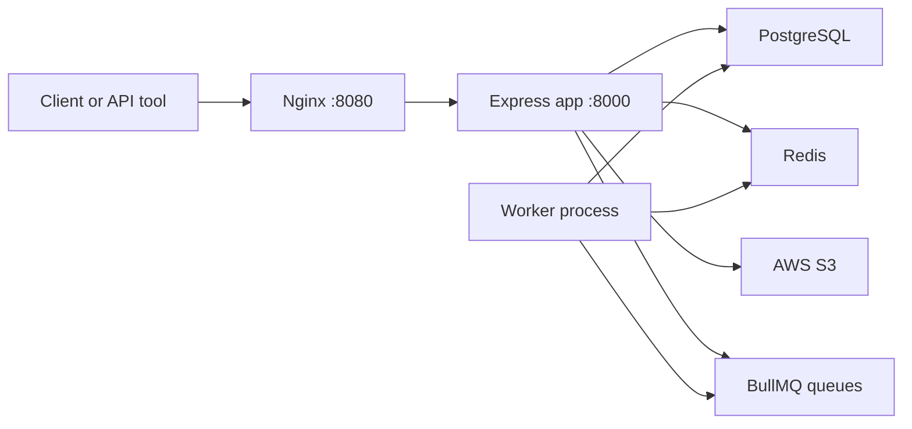
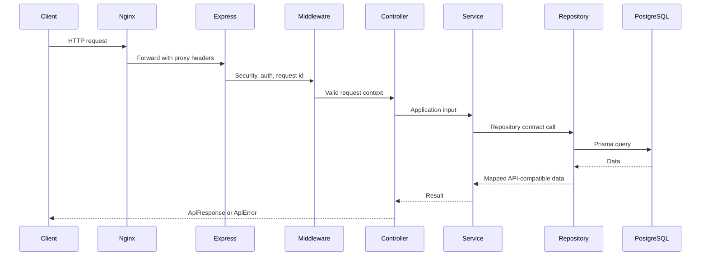
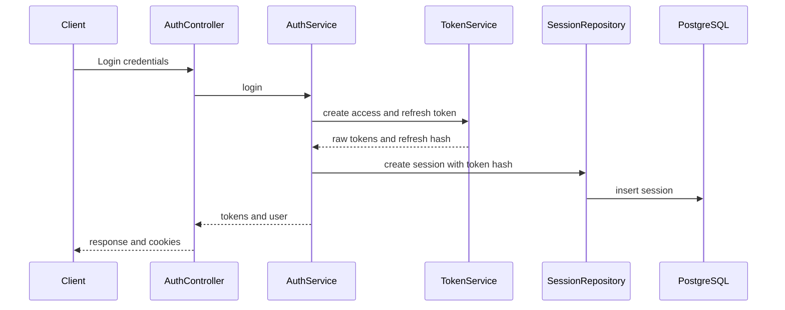
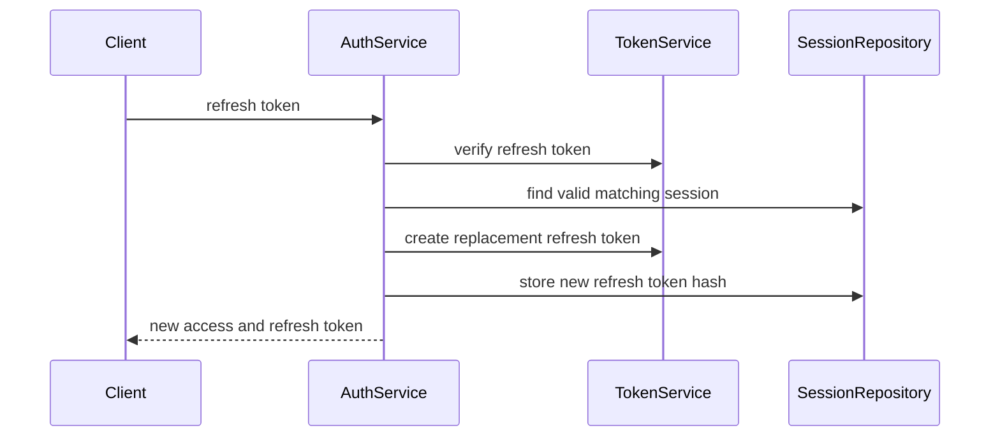
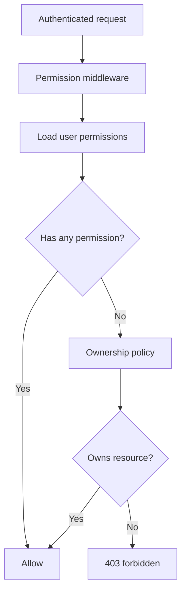
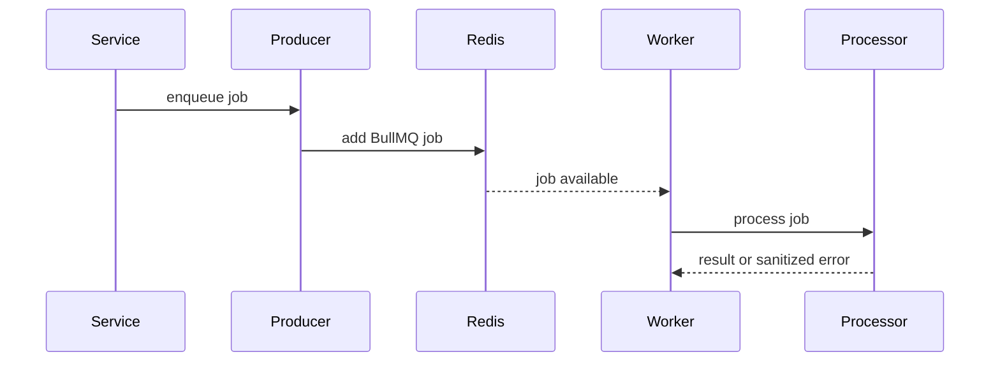
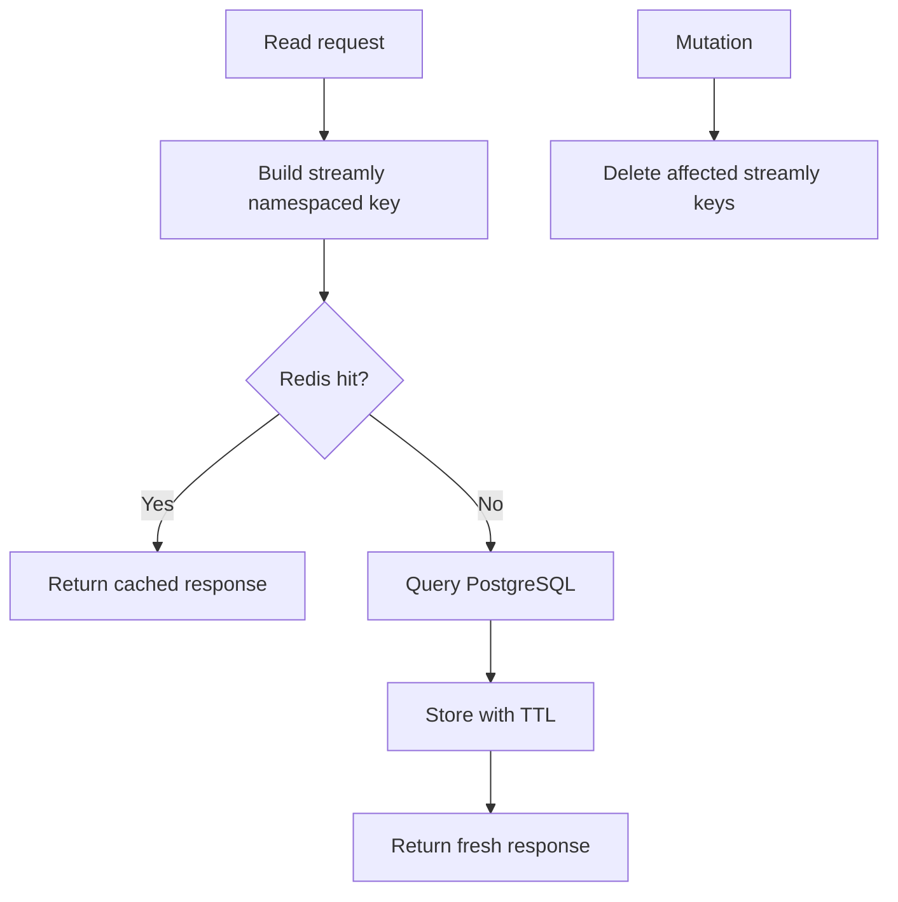
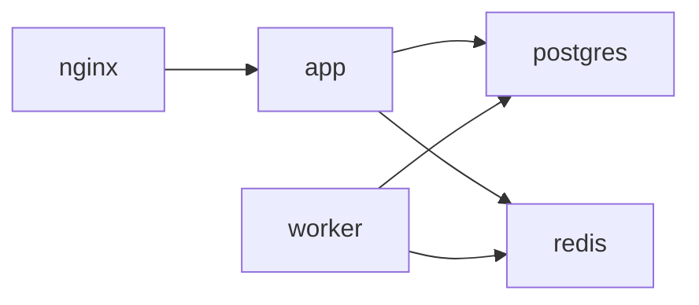

# Streamly Architecture

Streamly uses clean architecture to keep business rules independent from
framework, database, queue, and storage details.

## Goals

- Keep controllers thin.
- Keep business workflows in application services.
- Keep persistence behind repository contracts.
- Keep infrastructure replaceable.
- Preserve existing API behavior.
- Support future deployment and scaling work.

## Layer Responsibilities

| Layer | Responsibility |
| --- | --- |
| Presentation | Express routes, middleware, controllers, request parsing, responses |
| Application | Use-case orchestration, auth workflows, caching decisions, job enqueueing |
| Domain | Repository contracts and core authorization concepts |
| Infrastructure | Prisma, PostgreSQL, Redis, BullMQ, S3 media, Pino, adapters |
| Core | Dependency composition and container wiring |
| Shared | API responses, errors, validators, constants, helpers |

## Dependency Direction



Rules:

- Controllers do not import Prisma.
- Services do not depend on Express response objects.
- Repositories do not contain HTTP logic.
- Infrastructure owns external libraries.
- The container wires concrete implementations.

## Folder Structure

```txt
src/
  app.ts
  index.ts
  application/services/
  config/
  core/container/
  domain/repositories/
  infrastructure/
    cache/
    cloudinary/ legacy fallback
    database/
    jobs/
    logger/
    redis/
    repositories/
  presentation/
    controllers/
    middlewares/
    routes/
  shared/
  workers/
```

## Runtime Topology



## Request Lifecycle



## Authentication Flow



Refresh token rotation:



## Authorization Flow



RBAC uses roles, permissions, user-role mappings, and role-permission mappings.
Ownership checks stay centralized in the policy service.

## Background Job Flow



Current queues support email verification, notifications, cleanup, S3 thumbnail
generation, and job health verification. Email delivery uses Twilio
SendGrid when configured, while SMS notification infrastructure uses Twilio
when enabled.

## Cache Flow



The cache fails open. Redis errors are logged safely and do not break API
requests.

## Logging And Request Context

Every request gets:

- request id
- correlation id
- structured HTTP log
- sanitized error log when errors occur

Pino writes JSON to stdout for Docker-friendly operation. Redaction protects
tokens, cookies, passwords, secret keys, token hashes, and connection strings.

## Docker Compose Topology



Services:

- `app`: Express API and Prisma migrations on startup.
- `worker`: BullMQ worker runtime.
- `postgres`: PostgreSQL 16.
- `redis`: Redis 7.
- `nginx`: HTTP reverse proxy.

## Technology Decisions

| Technology | Reason |
| --- | --- |
| PostgreSQL | Relational data, constraints, joins, production familiarity |
| Prisma | Typed schema, migrations, clean repository implementation |
| Redis | Cache and BullMQ infrastructure |
| BullMQ | Durable Redis-backed background jobs |
| Nginx | Production-style reverse proxy and hosted URL preparation |
| Pino | Fast structured JSON logging |
| Vitest and Supertest | Lightweight unit and API verification |
| OpenAPI | Accurate API documentation and client-facing contract |

## Boundaries Preserved

- API route count is now `52` after adding video streaming and auth-platform routes.
- Runtime source is TypeScript and builds to `dist/`.
- Public API response style is preserved.
- S3 media behavior is adapter-based.
- Smoke import does not start server or connect external services.
- Worker runtime does not start Express.
