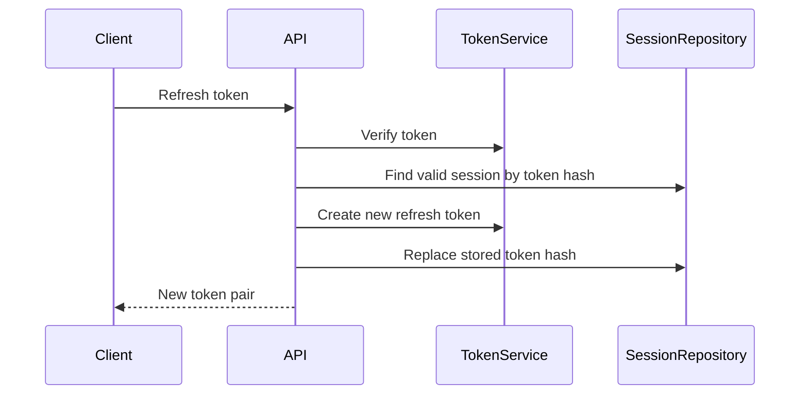

# Streamly Security

This document describes the current security posture. It is not a formal
security audit.

## Authentication Model

Streamly uses JWT access tokens and refresh tokens.

- Access tokens are short-lived.
- Refresh tokens are long-lived.
- Refresh tokens rotate on refresh.
- Sessions are stored in PostgreSQL.
- Refresh tokens are hashed before storage.
- Logout revokes the current session.
- Logout-all revokes all user sessions.

The hosted auth platform also supports staged signup, OTP login, and
authenticator-app MFA:

- email/password signup starts a pending account
- email OTP verifies ownership before onboarding continues
- optional phone verification can use Twilio SMS or Twilio WhatsApp
- authenticator-app TOTP is required for completed onboarding
- login supports email-password, email-otp, phone-sms-otp, and
  phone-whatsapp-otp start methods
- full sessions are issued only after MFA unless a short-lived MFA trust token
  is valid for the same device context

## Refresh Token Rotation

Expired or revoked sessions cannot refresh tokens.

## Session Storage

Session fields include:

- user id
- refresh token hash
- user agent
- IP address
- expiration
- revocation timestamp
- revocation reason
- last used timestamp

Raw refresh tokens are not stored.

## MFA Trust Token

MFA trust uses a short-lived hashed trust token bound to:

- user id
- HttpOnly device id cookie
- user-agent hash
- IP hash
- expiry timestamp

MAC addresses are intentionally not used. Browser and HTTP backends cannot
reliably read client MAC addresses.

## Smart Captcha

Cloudflare Turnstile is supported through a provider abstraction. Smart captcha
is risk-based: normal requests avoid captcha prompts, while repeated login or
OTP abuse can require Turnstile. The Turnstile secret and user token are never
logged.

## Email Verification Tokens

Email verification token infrastructure exists:

- tokens are generated by the application service
- token hashes are stored
- expiry is recorded
- used tokens cannot be reused

Email verification delivery uses Twilio SendGrid when explicitly configured.
Tests and CI use no-op delivery.

## RBAC Model

Authorization uses:

- roles
- permissions
- user-role mappings
- role-permission mappings
- middleware checks
- centralized policy service

Default roles:

- admin
- moderator
- creator
- user

Users cannot assign roles through public routes.

## Ownership Policies

Ownership policies protect own-resource actions such as:

- update own video
- delete own video
- update own comment
- delete own comment
- manage own playlist
- update own account

Admin or moderator style access is granted only through explicit permissions.

## Security Middleware

The Express security stack includes:

- trusted proxy configuration
- Helmet
- hardened CORS
- JSON and URL-encoded body limits
- cookie parser
- request sanitization
- HTTP request logging
- global rate limiter
- auth route rate limiter
- centralized error handler

## CORS

`CORS_ORIGIN` controls allowed origins. Development may use `*`. Production
should use explicit origins, especially when `CORS_CREDENTIALS=true`.

## Rate Limiting

Rate limiting is in-memory:

- global API limiter
- auth route limiter

Redis-backed distributed rate limiting is not implemented.

## Sanitization

Request sanitization removes:

- null bytes
- `__proto__`
- `constructor`
- `prototype`

It does not strip all HTML. User-generated text must still be escaped by
clients when rendered.

## Cookie Configuration

Cookie behavior is environment-aware:

- `httpOnly` cookies are used for auth tokens where applicable
- `COOKIE_SECURE` controls secure cookies
- `COOKIE_SAME_SITE` controls same-site behavior

Defaults favor local development. Production should enable secure cookies behind
HTTPS. The owner has confirmed HTTPS for `https://streamly.zytheran.me`.

## CSRF Decision

CSRF middleware is not enabled. The API supports bearer tokens and httpOnly
cookies with strict same-site defaults. Adding CSRF tokens would change client
flow and is deferred to a dedicated future hardening phase if cross-site cookie
auth is required.

## SQL Injection Review

Prisma is used for database access. Raw SQL is limited to parameterized health
queries. Dynamic ordering and filtering are constrained in repositories.

## Secret Handling

Secrets are read through centralized configuration. Real `.env` and
`.env.docker` files are ignored by git.

Never commit:

- JWT secrets
- database passwords
- Redis credentials
- S3 credentials, when static credentials are used outside EC2 IAM roles
- refresh tokens
- email verification tokens
- cookies

## Logging Redaction

Logs redact sensitive keys including:

- password
- access token
- refresh token
- authorization
- cookie
- token hash
- API secret
- database URL
- Redis URL

## Known Security Limitations

- No formal external security audit.
- No CSRF token flow.
- No certificate renewal automation.
- No distributed rate limiting.
- Dependency advisories currently exist.
- No external vulnerability monitoring integration beyond GitHub advisories.

## Reporting

No security contact is published yet. Use GitHub issues or private repository
communication if available.
