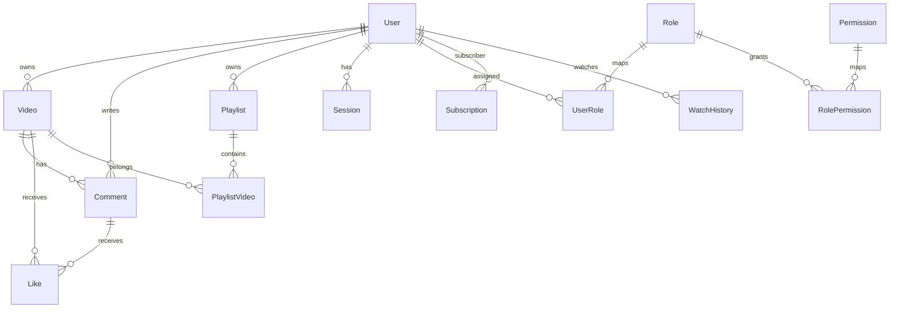
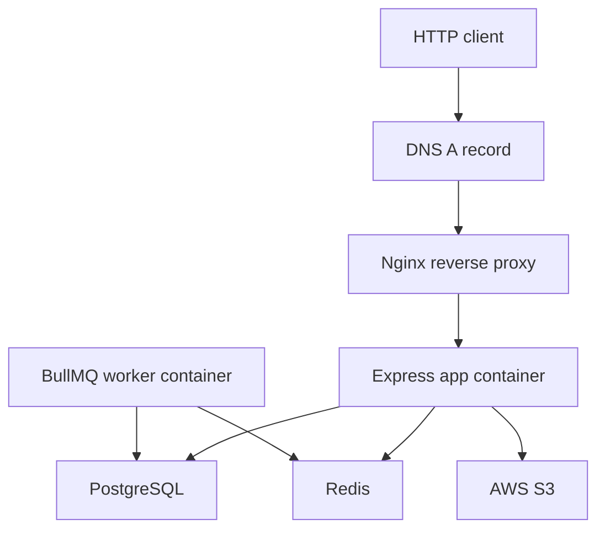

# Streamly System Design

Streamly is a backend for a video platform with users, videos, comments, likes,
playlists, subscriptions, dashboard statistics, authentication, authorization,
uploads, caching, queues, documentation, and operational tooling.

## Functional Requirements

- Register and authenticate users.
- Issue access tokens and rotate refresh tokens.
- Maintain persistent sessions.
- Upload avatars, cover images, videos, and thumbnails through S3.
- Publish, update, delete, and list videos.
- View public videos and video details.
- Add, update, delete, and list comments.
- Like videos, comments, and tweet-compatible entities.
- Create and manage playlists.
- Subscribe to channels.
- Read dashboard statistics for authenticated users.
- Protect write actions with RBAC and ownership policies.
- Document API contracts through OpenAPI.

## Non-Functional Requirements

- Preserve API compatibility.
- Keep clean architecture boundaries.
- Use PostgreSQL constraints for data integrity.
- Avoid direct ORM exposure in controllers.
- Provide Docker-based local runtime.
- Provide repeatable verification scripts.
- Provide structured logs and request IDs.
- Avoid logging secrets.
- Keep tests deterministic without external services.
- Support future hosted deployment.

## Main Entities

Core models:

- User
- Video
- Comment
- Like
- Playlist
- PlaylistVideo
- Subscription
- WatchHistory
- Session
- EmailVerificationToken
- Role
- Permission
- UserRole
- RolePermission

## API Modules

| Module | Responsibility |
| --- | --- |
| Healthcheck | Liveness and detailed service health |
| Users | Auth, current user, profile, avatar, cover image, watch history |
| Videos | Video CRUD, publish status, listing, details |
| Comments | Comment CRUD and comment listing |
| Likes | Toggle and list likes |
| Playlists | Playlist CRUD and playlist membership |
| Subscriptions | Channel subscriptions |
| Dashboard | Owner stats and owned videos |
| Docs | Swagger UI and OpenAPI JSON |

## Data Consistency

- PostgreSQL is the source of truth.
- Prisma migrations define schema changes.
- Foreign keys and unique constraints enforce relationships.
- Refresh tokens are hashed before persistence.
- Role and permission seeds are idempotent.
- Redis caches are derived and disposable.
- BullMQ jobs are retryable and idempotent where destructive work is involved.

## Cache Strategy

Cached:

- Public video list.
- Anonymous video comments.

Not cached:

- Auth/session flows.
- Current user flows.
- Dashboard.
- Video detail because it increments views.
- Authenticated comment reads when user-specific state may apply.

Invalidation is namespace-scoped with `streamly:` keys. Cache failures do not
fail API requests.

## Queue Strategy

BullMQ queues offload background-ready workflows:

- email verification through SendGrid when configured
- notification job foundation with Twilio SMS provider support
- auth cleanup jobs
- S3 ffmpeg thumbnail extraction jobs
- job health verification

Provider calls use safe no-op behavior unless explicitly enabled and
configured. No notification product or dashboard is implemented.

## Security Considerations

- JWT access tokens are short-lived.
- Refresh tokens are long-lived, hashed, and rotated.
- Sessions can be revoked individually or globally.
- RBAC protects action-level access.
- Ownership policies handle own-resource checks.
- Helmet and rate limiting reduce common API risks.
- Sanitization removes null bytes and prototype pollution keys.
- Prisma reduces SQL injection risk.
- Logs redact sensitive fields.
- CSRF tokens are deferred because adding them would change client flow; strict
  same-site cookies and bearer-token support are documented.

## Reliability Considerations

- Healthcheck route validates runtime state.
- Detailed health includes infrastructure status.
- Docker Compose healthchecks gate service startup.
- Prisma migrations run before app startup in Docker.
- Workers shut down separately from the API.
- CI verifies quality, tests, docs, Prisma, and Docker image build.

## Observability

- Pino structured JSON logs.
- Request and correlation IDs.
- HTTP request logs.
- Sanitized error logs.
- Audit log foundation for auth and authorization events.
- Docker logs route stdout/stderr through `docker compose logs`.

## Deployment Topology

The production domain is owner-confirmed as `https://streamly.zytheran.me`.
DNS and HTTPS renewal automation are not managed by this repository.

## Tradeoffs

- Runtime source has been migrated to TypeScript while preserving ES modules.
- Video streaming uses a trusted media provider abstraction and HTTP Range requests.
- Docker Compose is used instead of Kubernetes for approachable local runtime.
- Redis-backed distributed rate limiting is deferred.
- Email and SMS provider integrations require production credentials.
- Thumbnail processing uses ffmpeg frame extraction for S3 media without
  buffering full videos in memory.
- Database-backed integration tests are guarded, not enabled by default in CI.
- Dependency advisories are reported but not fixed in this documentation phase.

## Limitations

- No live deployment is claimed.
- No certificate renewal automation.
- No external monitoring provider.
- No admin UI.
- No formal security audit.
- No hard coverage threshold.
